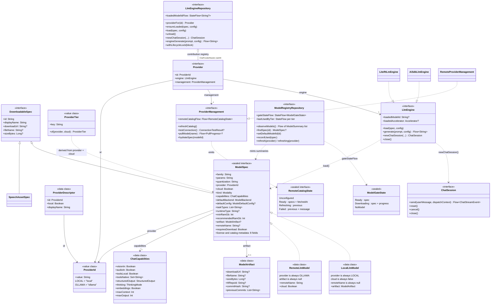
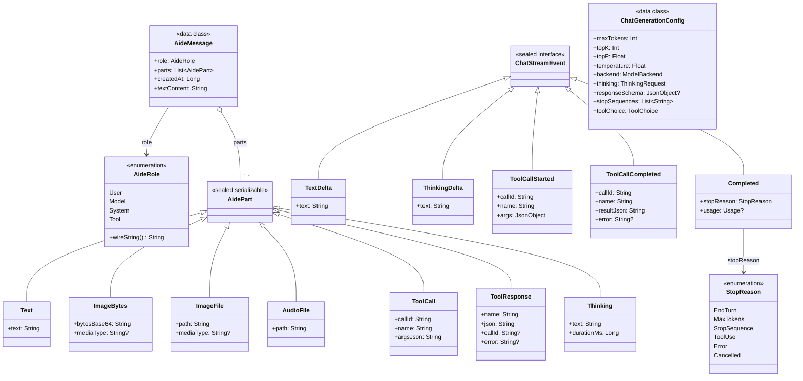
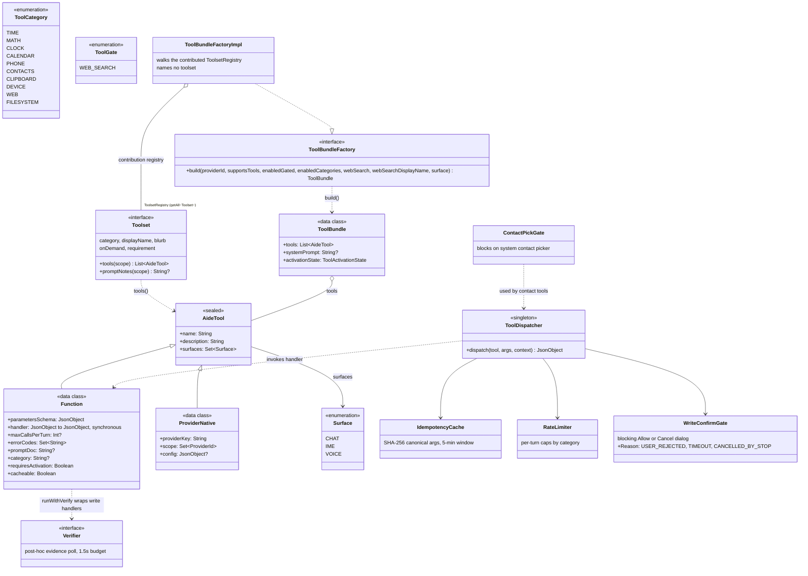
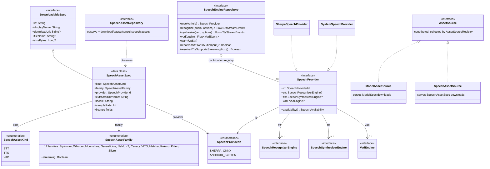

# Aide — Architecture

Last verified against the codebase on 2026-08-20, after the capability-pattern refactor (contribution
registries, one download stack, self-describing toolsets, an open model layer). Every factual claim below
was re-checked against source; the class diagrams in §3 are drawn from the actual type definitions.

Conventions live in [CLAUDE.md](CLAUDE.md); the structural truth is generated —
[docs/module-graph.md](docs/module-graph.md) and [docs/code-map.md](docs/code-map.md). Nothing here
restates either.

## 1. System architecture

```
┌──────────────────────────── Surfaces ─────────────────────────────┐
│  Chat tab (Compose)    Voice assistant            Keyboard        │
│        │          (VoiceInteractionSession)  (InputMethodService) │
│        │                     │                       │            │
│        ▼                     ▼                       ▼            │
│  SendChatMessageUseCase ◄─ VoiceTurnLoop        RunTaskUseCase    │
│        │                  (STT→LLM→TTS)      (toolless one-shot)  │
│        ▼                                             │            │
│  ┌── ChatSession (per provider) ──┐                  │            │
│  │  LiteRT-LM (on-device)         │   engineGenerate │            │
│  │  OpenAI-compat · Anthropic ·   │◄─────────────────┘            │
│  │  Gemini (cloud)                │                               │
│  └───────────────┬────────────────┘                               │
│                  ▼                                                │
│  ToolDispatcher → AideTool handlers                               │
│  (idempotency · rate-limit · confirm · verify · trace)            │
└───────────────────────────────────────────────────────────────────┘
Storage: Room (chats/messages/tasks) · DataStore-prefs (settings) · Tink-encrypted prefs (API keys)
Network: Ktor 3.5 (platform engine injected) — isolated clients per concern (AISDK_HTTP for every `:aisdk` provider, SEARCH_HTTP, CONNECTOR_HTTP, download)
Background: one DownloadScheduler — WorkManager on Android, a coroutine on the app scope elsewhere (Range-resume, FGS notifications)
Speech: Sherpa-ONNX (STT/TTS/VAD) + Android system engines + the cloud vendors (OpenAI, ElevenLabs, Gemini over `:aisdk`), one global provider pin per role
```

**Three product surfaces, two brains.** Chat and the voice assistant funnel into
`SendChatMessageUseCase` (full tool registry + transcript); the voice path drives it through
`VoiceTurnLoop` (the Layer-D IO channels — see §8) with `Surface.VOICE`. The **IME is different**: it runs `RunTaskUseCase` — a
plain, toolless `engineGenerate` prompt with a brevity preamble — so keyboard transforms never
touch the tool registry. `Surface` (CHAT / IME / VOICE) filters which tools a session may run;
today only CHAT and VOICE bundles are ever built (no call site constructs an IME bundle).

**Four chat providers, one contract** (more plug in with no shared-code edits — every feature must stay
provider-agnostic; see §2a for the mechanism):

| | LiteRT-LM (local) | OpenAI-compatible (remote/cloud) | Anthropic (remote/cloud) | Gemini (remote/cloud) |
|---|---|---|---|---|
| Transport | in-process Engine/Conversation | `:aisdk` `OpenAICompatibleProvider` — the `Vendors` row `CompatVendors` picks for the base URL — REST `/v1/chat/completions`, SSE | `:aisdk` `AnthropicProvider`, REST `/v1/messages`, SSE | `:aisdk` `GoogleProvider` (native, not compat — compat drops `thought_signature`), SSE |
| Vendors | bundled allowlist | OpenAI · **Ollama** (self-hosted `…:11434/v1` + cloud `ollama.com/v1`) · OpenRouter · Groq · Together · Fireworks · DeepInfra · Cerebras · Perplexity · xAI · HuggingFace · vLLM · LM Studio · any other base URL | Claude | Google |
| Tools on the wire | `OpenApiTool` descriptors, `automaticToolCalling=false` | `Tool.Function` → `tools[]`; the provider assembles streamed call deltas into one `ToolCallPart` | `Tool.Function` → `tools[]`, `input_json_delta` assembled by the provider | `Tool.Function` → `functionDeclarations`; `thoughtSignature` rides the call's `providerMetadata` |
| Reasoning | Gemma `"thought"` + `enable_thinking` | `CallOptions.reasoning` (`ReasoningEffort`) → `reasoning_effort`; stream: `reasoning_content` / `reasoning_details` / inline `<think>` all surface as `ReasoningDelta` | `CallOptions.reasoning` → per-model protocol (`enabled`+budget ≤4.5, adaptive + `output_config.effort` 4.6+, omitted on always-on models); stream: `ReasoningStart/Delta/End`, the signature on `ReasoningEnd.providerMetadata`, `redacted_thinking` as an empty block with a payload | `thinkingConfig`; the `thoughtSignature` on the block's or the call's `providerMetadata` |
| History | engine KV cache, replayed on rebind | explicit message list | explicit list incl. signed thinking + redacted blocks, in order — `Step.toAssistantMessage` replays every part with its metadata | explicit message list |

The loop above the wire is ONE: `AiSdkChatSession` (`data/llm/aisdk/`) runs every remote turn through
`:aisdk:runtime`'s `streamText` — prompt standardisation, the multi-round tool loop, call validation — and
maps `RunEvent`s onto the neutral `ChatStreamEvent`s; `ToolDispatcher` executes the calls (serially, behind a
mutex, so the confirm gates never race). `MessageNormalizer` repairs persisted history once before every turn
(id pairing, orphan drop, coalescing, and an error result for any call a crash left unanswered).

**Ollama folded into OpenAI-compatible (2026-06-17):** Ollama speaks the OpenAI `/v1` wire natively, so it
is a base-URL preset under the one OpenAI provider — its native NDJSON `/api/chat` engine + in-app model
pull were deleted (a redundant second wire). Ollama web search/fetch keep their own
`WebSearchCredentialsRepository` key, decoupled from chat. On-device LiteRT-LM runs the bundled allowlist.
A new OpenAI-compatible vendor = a preset row (zero code); a new WIRE (e.g. Anthropic) = a codec + **one
`bind ChatProvider::class`**, **zero shared engine/registry `when`s changed**, `/v1/models` auto-folds into
the registry (§4). The Add-model UI is data-driven (contributed `Vendor`s and their `ServiceDescriptor`s). **Reasoning/thinking is a
NEUTRAL cross-provider concept** — `ChatCapabilities.ThinkingMode` (minted per model-id, models.dev/LiteLLM
style) × `ChatGenerationConfig.ThinkingRequest` × `RemoteChunkEvent.Thinking(text, signature?, redactedData?)` →
`ChatStreamEvent.ThinkingDelta`; each codec maps its wire dialect, per-router quirks in `OpenAiCompatProfile`
(resolved from base URL), no scattered branches. The session accumulates thinking-ish parts in ARRIVAL
order (a signature closes its block; redacted blocks interleave) — order is part of Anthropic's replay
contract, not cosmetics.

All three providers hide behind `ChatSession.send(...): Flow<ChatStreamEvent>` (5 event types:
TextDelta, ThinkingDelta, ToolCallStarted, ToolCallCompleted, Completed — the last carries a
`StopReason`, optional `Usage` (populated from the provider's token counts), and the provider's
verbatim `rawFinishReason`). Everything above the session — dispatcher, transcripts, UI events —
is provider-blind.

## 2. Layering (enforced by the module graph)

```
        app / desktopApp                     entry points — each also HOLDS its platform-only packages
                │                            (:app: LiteRT, device toolsets, assistant, permission trampoline)
                ├── di                       the Koin graph (the only place that sees both sides)
                │    ├── ui                  the shared UI (screens, ViewModels, nav graph)
                │    └── data                implementations (Room, DataStore, Ktor factory, catalogs)
                │         ├── data:llm · data:speech · data:speech:sherpa
                │         └── data:tools · data:connector
                ├── platform:android:surface:ime  the keyboard — its own lifecycle, UI and manifest
                ├── feature:tasks            an Android-only feature, storage included
                ├── platform:android         Android machinery (Compose-free)
                └── core:{common,domain,designsystem}
```

Every rule below is a **fact about the dependency list**, not a convention. The `LayeringRulesTest` ratchet
that used to assert them was deleted when the split landed: what it counted can no longer be written. The
one invariant a dependency list cannot express — that a package lives in exactly one module — is checked by
`./gradlew codeMapCheck`, wired into `make check`.

- **`:core:domain`** — the whole `domain/**` spine: chat/model/llm/speech/tool value types, the
  repository + provider ports, use cases. Pure Kotlin (coroutines, kotlinx.serialization, okio,
  kotlinx-datetime). It does not depend on `:data`, so domain→data is unwritable; it is a KMP module
  with a desktop target, so `android.*` cannot appear in it either.
- **`:core:common`** — the bottom: dispatchers, `PrefKey`/`PreferenceStore`, attachment classification,
  `PlatformPaths`, DI qualifier names, `DeferredBootstraps`. Depends on nothing of ours.
- **`:data`** — implementations bound to `:core:domain`'s ports. Cannot reference ui, features or
  surfaces: they are all above it.
- **`:ui`** and the surfaces — depend on the design system and the domain PORTS. **None of them
  depends on `:data`**, which is what makes ui→data / ime→data / assistant→data zero by construction.
- **`:di`** — wiring is the one place allowed to see both implementations and UI, so it sits above both
  rather than inside either.
- `AideLog` — settable logging seam so domain code never touches `android.util.Log`.

See §17 for the full module topology and what each module owns.

## 2a. Capabilities: contributed, not listed (2026-08)

Five capabilities — chat, speech, image generation, downloadable assets, tools — plug in the same way, and
the shape is load-bearing enough to state once.

**A port in `:core:domain`, a registry that collects whatever was bound.** Each capability has its own
named registry type — `ChatProviderRegistry`, `ManageableRegistry`, `SpeechProviderRegistry`,
`ImageProviderRegistry`, `AssetSourceRegistry`, `ToolsetRegistry` — rather than one generic
`ProviderRegistry<T>`, because generics erase and two `ProviderRegistry<*>` singles would be the same key
in the container. That is the same erasure that forces the remaining `Map<K, V>` multibindings to keep
their `named(...)` qualifiers; a named subtype needs none.

```kotlin
single { GeminiVendor(get()) }.contributes(Vendor::class)                          // :di, portable
single { LocalProvider(…) } bind ChatProvider::class                                  // :app, Android-only
single { ChatProviderRegistry(getAll<ChatProvider>()) }                               // :di, once
```

**What this replaced.** Two hand-written `Map<String, ChatProvider>` blocks, one in `:app` and one in
`:desktopApp`, kept in step by hand. Forgetting either shipped a provider on one platform with no compile
error — a silent failure with no ratchet against it. Now whether a capability exists on a target is a
property of that target's module graph, which is the same rule features and surfaces already followed.
`:di` `ProviderContributionTest` pins the mechanism against the container itself.

**Policy is injected data, never a second class.** Where two targets needed different behaviour inside one
implementation, there used to be two implementations:

| Was | Is | The difference, now |
|---|---|---|
| `SpeechEngineRepositoryImpl` + `DesktopSpeechEngineRepository` | one `SpeechEngineRepositoryImpl` | `SpeechResolutionPolicy` — an ordered ladder whose last entry is the terminal fallback |
| `LlmEngineRepositoryImpl` + `DesktopLlmEngineRepository` | one `LlmEngineRepositoryImpl` | `EngineLoadPolicy` — Android's memory trim + GPU→CPU retry, or `Direct` |
| `DirectFileSystemBackend` + `DesktopFileSystemBackend` | one `JvmFileSystemBackend` | `MimeTypeResolver` — Android's table, or NIO's probe |
| `AndroidModelStorage` + `DesktopModelStorage` | one `ModelStorageImpl` | nothing: written in okio it is plain commonMain |
| `AndroidSpeechAssetStorage` + `DesktopSpeechAssetStorage` | one `SpeechAssetStorageImpl` | nothing, same reason |

**Cloud is commonMain; platform is platform-held.** A cloud implementation is Ktor plus an injected
engine, so it costs nothing to support everywhere and belongs in commonMain. A platform implementation
lives with the platform that runs it — a package inside its application (`:app`'s LiteRT provider,
`app.llm`) or a platform module when a second consumer shares it (`:data:speech:sherpa`) — and exists on
a target because that target compiles it.

**JVM-shared code has a home.** `aide.kmp.library` wires `src/jvmShared/kotlin` into both JVM source sets
when the directory exists: one directory, two source sets, deliberately not an intermediate `dependsOn`
set (Kotlin does not officially support a JVM+Android shared source set). It is the right answer only
after commonMain has been ruled out — okio and Ktor cover most of what looks JVM-shaped.

**The recipe, measured.** Image generation was added after this refactor as its proving ground. It cost:
`:core:domain/image/` (4 types), `ImageCapabilities` + `RemoteImageModel`, `:data/image/openai/` (an
engine, a provider, a wire model, a catalog), a `GenerateImage` toolset, and three `:di` bindings. No
platform DI file mentions it; there is no per-platform engine and no stub for the target that lacks one.

## 3. Class diagrams

How the core types stack: bases, extensions, relationships, load-bearing fields.

### 3.1 Models & providers



Key invariants encoded in the hierarchy:

- `ModelSpec` is **open**, not sealed. It was sealed over `LocalLlmModel`/`RemoteLlmModel` and every
  spec carried `ChatCapabilities`, which meant an image model could exist only by inventing a context
  window for itself. Now the modality-neutral facts are on `ModelSpec`, the chat-shaped ones
  (`capabilities`, the sampler `defaultConfig`) on **`ChatModelSpec`**, and a new modality is a new spec
  type in its own file — `RemoteImageModel : ImageModelSpec` was exactly that.
- Locality is fields, not a subtype: a spec with an `artifact` has weights on this device, one with a
  `remoteName` is addressed over a wire, and the concrete types uphold the exclusivity.
- **`ModelDescriptor`** is the thin identity `ModelSpec` and `SpeechAssetSpec` share — id, provider,
  modality, `requiresDownload`. Deliberately thin: merging their bodies would put back the stray nulls
  that splitting them removed (DEFERRED.md E6).
- The chat pipeline is typed against `ChatModelSpec`, so it cannot be handed a model that has no context
  window. The narrowing happens once, where a conversation is entered (`SendChatMessageUseCase`), with a
  real message rather than a silent skip.
- `requiresDownload` keys on `downloadUrl != null`, **not** `artifact != null` — orphan/AICore
  local specs carry an artifact with a null URL and must stay un-downloadable.
- `ProviderTier` (a string value class) derives from the typed `(provider, cloud)` pair — never
  from id-prefix parsing.
- `ProviderId` is an **open string value class** (`LOCAL`/`OPENAI`/… are named constants, not enum
  cases); provider-conditional logic reads `ProviderDescriptor.local` from the static
  `ProviderCatalog` table, not `== ProviderId.LOCAL`. Adding a provider means a `ProviderCatalog`
  row + **one `bind ChatProvider::class`** — no enum edit, and no central map (§2a).
- Engines must **silently drop** unsupported `ChatCapabilities` fields (warn-and-continue): a
  degraded reply beats an exception mid-stream.

### 3.2 Messages & streaming



- `AidePart` is `@Serializable` with `@SerialName` discriminators — `partsJson` in Room is both
  the persistence schema and the replay source (`ignoreUnknownKeys` + plain-text fallback give
  forward compatibility).
- `Thinking` parts are UI-only (stripped before replay so the model never sees its own scratchpad).
  `ToolCall` parts ARE replayed: the remote mappers emit them as wire tool-calls, and the LiteRT
  mapper replays them via `Message.toolCalls` (previously dropped, which orphaned the paired tool
  result). Image parts carry an optional `mediaType` captured at attach time; `ImageFile` (chat
  attachments) and `AudioFile` (mic-clip voice input via `MicClipRecorder`/`VoiceInputChannel`) have
  producers — `ImageBytes` does not yet (the raw-bytes `AudioBytes` variant was removed).
- Stream invariants: text is **delta-only** (never cumulative); exactly one `Completed`
  terminates a send; provider-native tools skip `ToolCallCompleted` (output surfaces as
  subsequent `TextDelta`s).
- **Wire normalization** (`normalizeForWire`, `:data:llm` `MessageNormalizer.kt`): one list-level repair
  pass runs ONCE before any provider codec maps the persisted, provider-neutral history — it reassigns
  globally-unique paired tool-call ids, drops orphaned tool results, fans a multi-result tool turn out
  to one message each, and coalesces consecutive same-role messages. Each `*MessageMapping` then maps a
  pre-validated history instead of re-deriving id-pairing / coalescing N divergent ways.

### 3.3 Tools



### 3.4 Speech & downloads

> Historical figure — read it with the corrections noted underneath.



> **Read this diagram with two corrections.** `SpeechProviderId` and `SpeechAssetKind` are gone: speech
> providers are `ProviderId.SHERPA`/`ANDROID_SYSTEM`, and `SpeechAssetSpec.modality` is a `Modality`
> (asr/tts/vad). And the download half is now one stack shared with LLM weights — `AssetSource` is a
> common okio-based port collected into an `AssetSourceRegistry`, `DownloadScheduler` takes `(kind, id)`,
> and there is no `ModelDownloadRepository` any more (§4a). The two SPEC hierarchies stay deliberately
> separate, sharing only the thin `ModelDescriptor` identity — not one fat `ModelSpec`.

## 4. Model & provider management

**Catalog and registry.** The class named `ModelCatalog` holds only the bundled allowlist
(`assets/model_allowlist.json`, Gallery-compatible wire format, init'd in `AideApp.onCreate`).
The merged view lives in `ModelRegistryRepositoryImpl`, which combines `ModelCatalog` with **every
manageable provider's** remote catalog — folding over the injected `ManageableRegistry` →
`management.remoteCatalogFlow`, with no concrete provider dependency. One `RemoteProviderManagement` serves
every remote vendor; what differs is injected — a live `/models` listing through `AiSdkModelCatalog` for
OpenAI-compatible servers and Anthropic, a curated list for Gemini. The registry is the single source of truth for the per-model
UI snapshot (`ModelSummary`), default/last-used selection (persisted per `ProviderTier`), and the
`ModelGateState` (Ready / Downloading / NoModel) that gates whether the app can hold a conversation.

The registry is constructed **for one `Modality`** (chat today) rather than hardcoding it: the active-model
preference was already stored per modality, and this was the last thing in the chain that assumed chat. A
second modality is a second instance.

**Provider connectivity (2026-09-24: connections).** Superseded: a cloud provider is no longer one
credential per `ProviderId`. The user holds any number of *connections* (`ConnectionRepository`: the
`connections` document + each key in `SecureStore` at `connection.<id>.api_key`), each an instance of a
contributed `Vendor` and named after its `ServiceDescriptor`; the connection id is the runtime
`ProviderId`. See CLAUDE.md, "Cloud providers are connections, not bindings".

**Downloads.** See §4a — one stack, every asset kind, both targets.

**Residency (Phase 5).** `ResidencyManager` is one refcount + lifecycle authority across every
modality. A caller `acquire(ResidentModel)`s AFTER its spec resolves: the model loads inside a
serialised queue (a `loadMutex` independent of held handles, so nested acquires never deadlock),
refcounts so it's never unloaded mid-request, and idle-releases on a per-surface keepAlive once the
last hold drops (chat 5 min, voice 60 s, IME 1.5 s). `AideApp.onTrimMemory → onTrimMemory` LRU-evicts
unheld `LOADED` residents under pressure. `Residency.NONE` (remote chat, android-system speech) is a
no-op handle — loaded once for its wire marker but never refcounted or evicted. The LLM is acquired
per-turn inside `SendChatMessageUseCase` (chat **and** voice) and per-task in `RunTaskUseCase` (IME,
which no longer unloads the engine directly); the voice controller additionally holds asr/vad/tts for
the session. `LlmEngineRepositoryImpl` keeps GPU→CPU fallback for LOCAL loads (via the injected `EngineLoadPolicy`, §2a)
but no longer
cross-closes providers — the manager owns eviction; same-provider replacement self-evicts inside the
engine's own `load()`. Adapters are built from domain interfaces only (`ResidentModel` carrying
`residency` from `ProviderCatalog.local` + a memory estimate from `spec.sizeBytes`), so the manager
stays backend-agnostic.

## 4a. Downloads: one stack, any asset kind (2026-08)

There used to be two: a common `DownloadScheduler` that speech used, and an Android-only
`ModelDownloadRepository` port with a desktop stub that LLM weights used — plus an Android-only
`AssetSource` map speaking `java.io.File` while everything under it spoke okio.

Now:

- **`DownloadScheduler`** (`:core:domain/download`) takes `(kind, id)` and nothing else. A caller never
  says where a file goes or which URL it comes from.
- **`AssetSource`** (`:data/download`, commonMain, okio) answers that: it resolves an id to a
  `DownloadAsset`, verifies what lands, post-processes it (the speech source unpacks the `.tar.bz2` here,
  which is why the asset repository no longer needs to know whether the pipeline already did), reports
  installation from disk, and deletes. Sources are contributed and collected into an
  `AssetSourceRegistry` (§2a).
- **Two schedulers, one resolution path.** `AndroidDownloadScheduler` delegates to the WorkManager-backed
  `DownloadController` (survives process death, foreground-service notification with Pause/Cancel);
  `CoroutineDownloadScheduler` runs `DownloadEngine` on the app scope. Both resolve paths through the same
  registry, both treat on-disk state as authoritative, and both run the source's post-process step.
- **`ModelStorage`** is a `:core:domain` port over okio paths with one shared `ModelStorageImpl` —
  `{filesDir}/models/{normalizedId}/{commitHash}/{fileName}`, stated once. Gaining on-device models on a
  new target is a catalog, not a port.

Adding a downloadable capability is one `AssetSource` binding. HTTP Range resume, progress, pause/cancel,
verification and the notification are already written and know nothing about what they are fetching.

## 5. Chat pipeline

`SendChatMessageUseCase` (channelFlow of UI events), in order:

1. **Hard guards** (error out): spec in catalog; downloaded if `requiresDownload`.
2. **Vision gate** (degrades): the optional image attachment is dropped with a warning unless
   `spec.capabilities.visionIn` — never fails the turn. Images arrive as an `imagePath`
   persisted through the `ImageAttachmentStore` core port (impl: `data/attachments/ImageStore`).
3. **Engine warm-up**, then per-turn snapshot of tool settings.
4. **toolsLocal gate** feeds the session-rebind decision: session is reused unless model /
   gates / search provider / categories changed (tools are immutable per session — a LiteRT
   constraint that sets the rebind rule for both providers).
5. Bind progress/confirm/pick emitters → stream `ChatStreamEvent`s → persist incrementally to
   the transcript (Room-backed `PersistentChatTranscript`, or `InMemoryChatTranscript` for
   incognito).

Thinking segments are UI-only — stripped before any replay so the model never sees its own
scratchpad. `stop()` cancels the in-flight turn and resolves all pending confirm gates with
`CANCELLED_BY_STOP` (surfaced to the model as error code `CANCELLED_BY_USER` in the tool
envelope; `ContactPickGate` is completed with null) so no native worker blocks on a dead dialog.

## 6. Tools pipeline

**Tool model** — `domain/llm/AideTool` (sealed), see §3.3:
- `Function`: name, description, hand-built JSON-schema (`ToolCommon` helpers), synchronous
  `handler: (JsonObject) -> JsonObject` (LiteRT invokes handlers from a non-coroutine native
  thread), `surfaces`, `maxCallsPerTurn`, `errorCodes`, `promptDoc`, lazy-activation flags, and
  `cacheable` (default true; `cacheable=false` bypasses the idempotency cache both ways — for
  tools that mutate volatile device state, e.g. the torch). **Provider-agnostic by
  construction** — never coupled to LiteRT `@Tool` annotations.
- `ProviderNative`: server-executed capability scoped by `ProviderId` (declared; no
  construction sites yet).

**Assembly** — `ToolBundleFactoryImpl : ToolBundleFactory` (`:data`, commonMain) builds a per-session
`ToolBundle`. It **names no toolset**: it walks the contributed `ToolsetRegistry`, stamps every tool with
the category of the toolset that produced it, and applies the four general filters — supportsTools (early
return) → **provider scope → surface → category toggles** (opt-in settings, default all-off; cross-cutting
tools with no category are never hidden) → cross-cutting props (`idempotency_key`, `__trace_id`) → append
`RequestToolset`.

A **`Toolset`** declares its own category, display name, blurb, on-demand flag, `CategoryRequirement`
(the permission the user must grant) and any prompt guidance the schemas cannot express. That is what
turned "add a tool" from a seven-place checklist into new files plus one binding, and what lets Settings
draw its rows from the registry. On-demand categories (Clock/Phone/Calendar/Contacts/Clipboard/Image) hide
behind the `RequestToolset` meta-tool to keep prompt and wire size down; Time/Math/Web/Device/Filesystem
are eager. `ToolCategory` is an open string id, not an enum.

The bundle also carries the generated system prompt (`SystemPromptBuilder`: per-surface header, tools
grouped by the stamped category in registry order, each active toolset's own notes, the error dictionary,
rules). Its four tool-name tables are gone — a tool carries its category, and the keyboard's "switch to
chat" hint is derived from the tools' declared surfaces.

Because the factory and the portable toolsets (time, math, web, filesystem) are common code, **desktop has
real tools** and there is no empty-bundle stub anywhere.

**Dispatch** — every call from either provider routes through `ToolDispatcher.dispatch()`:
ask-before-each gate (optional, CHAT-only) → idempotency cache (5-min window, skipped when
`cacheable=false`) → rate limiter (per-turn caps: READ 20, INTENT_FIRE 3, NETWORK 5,
DESTRUCTIVE 2) → handler → tracer.

**Safety model** — three confirmation tiers + verification:
1. `WriteConfirmGate` (INFO/WARN/DANGER) — blocking Allow/Cancel dialog for destructive ops
   (file move/copy/delete, calendar/contact delete), 60s timeout, distinct denial codes.
2. System-UI implicit confirm — phone/clock/calendar-add tools fire pre-filled intents; the
   user taps Save/Send/Call in the target app, so Aide holds no CALL_PHONE etc. Because the
   IME and assistant cannot start activities directly, intent tools fired from those surfaces
   trampoline through the transparent `IntentBrokerActivity`; CHAT fires from the host activity
   (both halves live in `intent/`).
3. `ContactPickGate` — blocks PickContact on the system picker.

Write tools then run a `Verifier` (alarm/contact/calendar evidence poll, 1.5s) and stamp
`verified: true/false` into the envelope; the system prompt forbids claiming success otherwise.
(The Device toolset verifies the torch with a bespoke inline 1.5s `TorchCallback` poll rather
than `runWithVerify`, and opts out of caching instead of confirming.)

**Result envelopes** — every handler returns `{ok: true, ...}` or
`{ok: false, errorCode, error}` via per-domain `ToolResult` types (portable ones in `:core:domain`
`domain/tools/results/*`; device ones in `:app` — `app/tools/results/*` plus
`app/tools/calendar/CalendarResult.kt`, `app/tools/contacts/ContactsResult.kt`;
`ClipboardResult` is inline in its data toolset); error codes are documented to the model in
the prompt's error dictionary.

### Adding a tool

1. Write a **`Toolset`**. Portable? → `:core:domain/tools/` or `:data:tools/`, and every target gets it.
   Device-bound? → `:app`'s `app/tools/`, and only Android does. It declares its category, display name,
   blurb, on-demand flag, `CategoryRequirement` and (if the schemas can't say it) its prompt notes.
2. Result type in `domain/tools/results/<Area>Result.kt` (envelope via `ToolEnvelope`).
3. **Bind it**: `single { MyToolset(…) } bind Toolset::class`. That is the whole registration — the
   registry collects it, the factory stamps its category, the prompt groups it, Settings draws its row.
4. New error codes → `SystemPromptBuilder.ERROR_MEANINGS` (the one table that is still a table, because
   an error dictionary is genuinely cross-cutting).
5. Intent-based tool → `<queries>` entry in `AndroidManifest.xml`, dispatch through the injected
   `IntentDispatchers.forSurface(scope.surface)`, and pick `surfaces` deliberately (`BOTH_SURFACES` /
   `CHAT_AND_VOICE` / `CHAT_ONLY`).
6. Destructive? → `WriteConfirmGate` with severity; verifiable? → `runWithVerify`.

There is **no** step for editing an enum, a prompt table, a lazy list, a permissions table or the
factory's constructor. If a change seems to need one, the seam is wrong.

(Exercised end-to-end by image generation: `ImageToolset` in `:data/image/`, one binding, and it works on
both targets — see §2a.)

## 7. Web search & fetch

`ProviderChain` tries providers in priority order (Brave → Tavily → Ollama-cloud → DuckDuckGo
scraper as keyless terminal fallback; user override jumps the queue), 4s per provider / 10s
total. API keys in Tink-encrypted prefs (per-provider-id key strings — the credential-store
pattern to generalize). `WebFetch` (always eager when Web category on) fetches + Jsoup-strips
boilerplate, 10k-char cap, typed error codes. Dedicated Ktor client isolated
from the download client (`SEARCH_HTTP`). The web-search settings VM enumerates providers dynamically with
per-provider `isAvailable()` — the in-repo template for multi-provider UI.

## 8. Speech

Three planes (~40 files the previous doc compressed into one line):

**Engine plane.** Domain contracts `SpeechRecognizerEngine` / `SpeechSynthesizerEngine` /
`VadEngine` with sealed stream events (`SttStreamEvent`, `TtsStreamEvent`, `VadEvent`). Each speech
stream terminates in ONE uniform `End(outcome: SpeechStreamOutcome)` — `Done | Error | Cancelled` —
folding failure into the terminal (as chat's `ChatStreamEvent.Completed` already does), so a consumer
has a single "is-terminal / did-it-fail" branch. Engines are grouped
per provider by `SpeechProvider` (see §3.4). On-device: Sherpa-ONNX (STT/TTS/VAD; bundles resolved by
`SherpaBundleResolver`) and the Android system engines (no VAD). Cloud: OpenAI, ElevenLabs and Gemini,
each the vendor's one `:aisdk`-backed provider class contributing `SpeechProvider` beside its other
capabilities; their engines are the `:data:speech` `cloud/` adapters — `CloudSttEngine` buffers the
16 kHz mic, endpoints on an energy VAD, and posts one WAV to the vendor's transcription model;
`CloudTtsEngine` asks for raw PCM at a vendor-decided rate and streams it as chunks, so the same
`AudioPlayer` path plays it. `SpeechEngineRepositoryImpl.resolve(role)` applies **one global provider
pin** from prefs; in Auto it prefers the vendor that owns the active cloud model for that role (the
`CloudSpeechCatalog` port says who), then the platform ladder (Sherpa → System). A cloud vendor is never a
silent fallback. Surfaces get per-surface *enable* toggles (IME dictation, main-chat dictation, voice
loop), not per-surface engine choice. Capability quirks surface as booleans
(`resolvedSttOwnsAudioInput`, `resolvedTtsSupportsStreamingPcm`).

**Session plane (Layer D — IO channels).** `VoiceTurnLoop` (data) runs the assistant's full-duplex
loop as swappable channels: `VoiceInputChannel` (mic capture `AudioRecordCapturer` → VAD turn-taking
`VoiceTurnPolicy` → STT, emitting content-IR `InputEvent`s) → a `VoiceReasoner` that adapts
`SendChatMessageUseCase.Event` to a provider-neutral `ReasonEvent` ONCE (so the speech layer isn't
welded to the chat use case) → `VoiceOutputChannel` (sentence-split streaming TTS via
`SentenceSplitter`/`AudioPlayer`), exposing `VoiceLoopState`. `AudioFocusGate` and
`SensitiveAudioPolicy` police the audio session. Dictation is separate:
the `DictationController` core port (entered via `StartDictationUseCase`) streams STT into a
per-surface `DictationSink` keyed by `DictationSurfaceId` — `InputConnectionSink` commits into
the IME editor, `StateFlowStringSink` feeds Compose text fields. `ActiveSpeechBootstrap`
reconciles active STT/TTS model prefs and auto-downloads a VAD model for non-streaming STT.

**Asset plane.** `SpeechAssetCatalog` (static) declares downloadable STT/TTS/VAD bundles
(`SpeechAssetSpec`), served through the same `AssetSource`/WorkManager download engine as LLM
models, extracted by `SpeechBundleExtractor` into `SpeechAssetStorage`. `SpeechAssetRepository`
mirrors the model registry for observation + download control.

## 9. IME architecture

`AideInputMethodService` owns the engine lifecycle for keyboard use (load on demand, 1.5s idle
unload, unload on destroy) and hosts a `PageHost`/`PageFactory` page system — classic Views,
not Compose (`KeyboardPage` built from `KeyboardSpec`/`KeyboardRowBuilder`/`KeyFactory`, touch
via `KeyTouchDispatcher`, popups/sheets in `ime/widget`). `TextContextRepository` captures the
focused field's text via `TextContextSource`; `SensitiveFieldPolicy` replaces password-field
content with a placeholder so it never reaches the LLM (it deliberately ignores
`TYPE_TEXT_FLAG_NO_SUGGESTIONS` to avoid false positives). `TransformController` (singleton) is
the IME brain: surfaces task-group chips (`TaskStripView`/`TransformBar`), runs
`RunTaskUseCase` over the field text with custom instructions, and applies results to the
`InputConnection` either immediately (APPLY) or staged in a `QueueSheet` (QUEUE), with
`ResponsePopupView` for streaming preview. `ime/theme` holds keyboard-local design tokens.

## 10. Assistant overlay

`AideVoiceInteractionService`/`SessionService` instantiate `AideAssistantSession`, a
`VoiceInteractionSession` hosting a Compose overlay — the session manually installs the three
Compose view-tree owners (no ComponentActivity), kills the system `windowContentOverlay` white
frame, and re-keys the enter animation per `onShow`. `AssistantVoiceController` mediates
between the session and the speech stack: gates on RECORD_AUDIO via `RuntimePermissionGate`,
acquires the asr/vad/tts models for the session through the `ResidencyManager` (the LLM is acquired
per-turn inside `SendChatMessageUseCase`), and drives `VoiceTurnLoop`.
`assistant/ui` renders the overlay surface, controls, and a `VoiceOrb` animated from
`VoiceLoopState`.

## 11. Permissions

A dedicated `permission/` subsystem centralizes runtime + special permissions. `AppPermission`
is an enum mapping each capability (RECORD_AUDIO, CALENDAR, CONTACTS, …) to its manifest
permission set, rationale copy, and owning `ToolCategory`; `SpecialPermission` covers
non-runtime grants (Settings-panel paths). `RuntimePermissionGate` is the injectable suspend
gate every consumer (toolsets, verifiers, audio capture, dictation, assistant) awaits; it
launches the transparent `RuntimePermissionActivity`, which shows the in-app rationale first,
handles the permanently-denied state, and routes special permissions through system Settings.
`PermissionOutcome`/`PermissionResult` propagate typed denials back to tool envelopes.
`ToolCategoryPermissions` (ui/settings/tools) derives the settings-screen requirement display.

## 12. Tasks & custom instructions

**Tasks** — user-defined and built-in prompt templates (`Task` with a `{text}` placeholder,
organized into `TaskGroup`s) stored in Room (`TaskDao`/`TaskGroupDao`, seeded from
`BuiltInTasks`/`BuiltInGroups`). `RunTaskUseCase` resolves the active model, substitutes the
captured text into the template, and streams the result via `engineGenerate` — deliberately
not owning engine load/unload (the IME does). Surfaced two ways: the Tasks route in the main
app (list/detail/edit CRUD) and the IME's task strip, where `TransformController` runs a tapped
task against the focused field's text.

**Custom instructions** — `CustomInstructionRepository` (domain contract, DataStore-backed impl
in `data/custom`) holds user-authored standing instructions, editable from the main app
(`ui/custom`) and directly inside the keyboard (`ime/page/keyboard/CustomInstructionsEditor`);
`TransformController` injects them into IME transform prompts.

## 13. UI framework & navigation

Navigation uses typed `@Serializable` `Route` objects in a single `AppNavGraph`
(`NavGraphBuilder.appDestinations` extension) hosted by `AppShell`. Modal flows live in a
custom sheet stack instead of Material's ModalBottomSheet: `AppSheet` is a hand-rolled
`AnchoredDraggable` two-detent sheet (40%/full, 35% drag-commit threshold, open glides only to
the first detent), and `NavigableSheet` layers a NavHost-like pages DSL on top with an in-sheet
back stack that survives recreation/process death (routes round-trip through
kotlinx.serialization codecs; launcher sessions reset the stack), `NavMotion` shared slide
transitions, and dialogs modeled as pushed pages. Shared components enforce consistency:
`AppPage` (always-scrollable page scaffold; Chat is the only fill-height screen via
`ChatScaffold`), `Placeholder` (single empty-state component with optional actions), and a form
kit (`AppTextField` + `FieldRule` validators + `AppFormError` banner + `FormActions` row).

The models screen is an "in use" list grouped by `Modality` (LANGUAGE/VOICE/IMAGE — a UI-only
enum; image generation is gated off behind `IS_IMAGE_SUPPORTED = false`) plus an
`AddModelSheet` wizard, and the same page hosts `SpeechLibraryList` for STT/TTS assets — one
management surface for all downloadable assets.

## 14. Dependency policy

Versions live in `gradle/libs.versions.toml`, including Sherpa-ONNX — it is consumed as GitHub release
artifacts rather than Maven coordinates (the Android AAR via `fileTree("libs")` in `:app`, fetched by
`downloadSherpaAar`; the API classes.jar extracted by `:data:speech:sherpa`; the per-OS native libs fetched
by `:desktopApp`), so all three read one `sherpaOnnx` version from the catalog. LiteRT-LM is kept in lockstep with Google AI Edge
Gallery (currently 0.11.0). HTTP stack is **Ktor 3.5 with the OkHttp engine** — migrated off direct
OkHttp on 2026-06-15; the OkHttp engine is kept *under* Ktor so HTTP/2
and per-token streaming are preserved. Direct `okhttp3.*` API usage is gone from app code; the OkHttp
dep remains (pinned 4.12) purely as the engine. Other deliberate divergences from Gallery:
kotlinx.serialization (not Gson/Moshi), preferences DataStore + Room (not proto-DataStore), Tink (not
androidx.security.crypto), no Firebase (privacy posture: on-device only). The Ktor migration also
unblocks the MCP client (its SDK requires Ktor).

## 15. Known architectural limits

Verified pain points the model-layer redesign (in progress) targets — kept here so the doc
doesn't oversell the current state:

- **Provider identity is open (Phase 1 done, 2026-06-14).** `ProviderId` is a string value class,
  provider-conditional logic reads `ProviderDescriptor`, `RemoteLlmModel.provider` is a ctor param,
  `ProviderTier` + `ProviderConfig` derive from `(provider, cloud)` with a stored `cloud` flag, and
  (connection config later moved to `ConnectionRepository`, keyed per connection). A new provider still needs its engine/codec +
  DI entry (Phases 6–7) but no longer an enum edit + scattered `when`s.
- **Registry is provider-agnostic (Phase 2 done, 2026-06-14).** `ModelRegistryRepositoryImpl` folds
  over `allProviders()` → `management.remoteCatalogFlow` (deriving specs/refreshing/fetchedAt from
  the `RemoteCatalogState` seam); the domain interface is provider-keyed
  (`refresh(provider)`/`refreshing(provider)`/`catalogFetchedAt(provider)`); no concrete
  `OllamaManagement` injection and no singular `@Binds ProviderManagement`. Settings reach
  management via `providerFor(id).management`. Remaining model-layer work is later phases (modality,
  residency, transport core).
- **Speech now shares the spine (Phase 4 done, 2026-06-14, Option-3 reframe).** Speech + LLM share
  `ProviderId` (speech providers are `sherpa`/`android-system`), `Modality` (`SpeechAssetSpec.modality` is
  `asr/tts/vad`; `SpeechAssetKind` deleted), the **capability-interface `Provider`** (`SpeechProvider :
  Provider` collected by a `SpeechProviderRegistry` alongside the chat and manageable ones),
  per-modality active-model pref slots, and per-modality gate readiness
  (`needsModelSetup` = chat + STT `availability(role)`). Deliberately NOT merged into one fat `ModelSpec`
  or one registry — that's the fat-interface coupling rejected for `Provider` (research-confirmed: Vercel/
  Spring AI keep typed per-modality specs). The unification is the **spine** + residency (Phase 5) + gate,
  not the spec. `SpeechEngineRepository.resolve(role)` keeps its pin→sherpa→system policy.
- **Output modality unrepresentable.** `ChatStreamEvent` has no image/audio events;
  `ChatCapabilities` has input booleans only; transcript persistence folds only
  Thinking/Text/ToolCall.
- **Residency unified (Phase 5 done, 2026-06-14).** `ResidencyManager` replaced the single-resident,
  load-centric lifecycle and the per-role `ResidentModelGuard`: refcount-per-model across modalities,
  serialised loads, per-surface keepAlive idle-release, LRU trim-evict. The single global
  `ModelGateState` still answers only "can the app run an LLM call".
- **Transport stream enriched (Phase 6.1 done, 2026-06-14).** `ChatStreamEvent.Completed` now carries
  `rawFinishReason` + a populated `Usage` (Ollama/OpenAI token counts; honest null otherwise). The rest
  of Phase 6 (reusable turn-runner, `ToolChoice`, `ToolCallDelta`, `extras`/thinking-signature) was
  reframed to co-develop with new providers — the seams are invisible with a single remote.
- **First new provider shipped (Phase 7 done, 2026-06-15).** An OpenAI-compatible provider (OpenAI /
  OpenRouter / Groq / vLLM / LM Studio, configurable `baseUrl`) plugged in with edits confined to
  `data/llm/openai/` + a DI module + two provider-identity rows — proof the abstraction is open. The
  Add-model UI was generalized to data-driven (since 2026-09-24: contributed vendors' services and the
  user's connections); a future service on an existing wire is one `service(...)` line.
- **Remote turn-runner extracted (Phase 6, 2026-06-15), then replaced by the SDK's loop (2026-09).**
  The duplicated multi-round tool loop first moved ONCE into `RemoteChatSession` behind a per-provider
  `RemoteChatCodec`; with every wire on `:aisdk`, that loop and its codec seam were deleted in favour of
  `AiSdkChatSession` over `:aisdk:runtime`'s `streamText` — one loop per SDK rather than one per app,
  with id-correlated reasoning blocks instead of "an empty text event closes the block". A new remote
  provider ships nothing: it is a `Provider` the session already speaks. `LiteRtLmChatSession` stays
  separate (local, stateful `Conversation`).
- **Tool handlers are suspend-first (2026-06-15).** `AideTool.Function.handler` + `ToolDispatcher.dispatch`
  are now `suspend`; the four `runBlocking` thread-parks (WebSearch, `WriteConfirmGate`/`ContactPickGate`
  60s gates, `Verifier`) are gone — gates/verify `await` as proper suspends, and dispatch RETHROWS
  `CancellationException` instead of swallowing it into a failure envelope. The old "LiteRT native thread"
  rationale was obsolete (LiteRT dispatches on `Dispatchers.IO`, a coroutine). A non-suspending lambda
  still satisfies the handler type, so the ~38 synchronous tools were unchanged. (App-wide async audit
  vs the official Kotlin/Android coroutine guides found this the lone HIGH-severity issue; cancellation
  hygiene, shared-state guarding, and `callbackFlow` awaitClose were already correct.)
- **Cross-modal/cross-provider audit fixes (2026-06-16; `docs/architecture-analysis.md`).** The audit
  (validated against Vercel AI SDK v5 / Microsoft.Extensions.AI / Spring AI / LangChain4j) confirmed the
  modality-first spine is right; the work was surgical and is now done:
  - **Message-IR round-trip (correctness).** A single `normalizeForWire` pass (§3.2) before any codec
    fixed cross-turn tool-call id collisions, orphaned tool results (incl. the LiteRT `Message.toolCalls`
    replay + the String-vs-Map double-encode), null/`tool_name` id fallbacks, missing same-role
    coalescing, multi-result tool turns, image `mediaType`, and a cached size-capped image encoder.
  - **Stream/IO seam.** All three streams now have a uniform terminal with failure folded in — chat's
    `Completed(StopReason)` was already conformant; the two speech streams gained `End(SpeechStreamOutcome)`
    and shed the dead `Endpoint`/`Boundary`/redundant-`Completed` cases. `domain.io` no longer depends on
    `domain.usecase`: the voice path speaks a neutral `ReasonEvent` (carrying the real text delta), and
    `InputChannel` is de-STT'd (`InputEvent.Partial(parts, progress?)`; mic RMS / `SttOptions` live on the
    voice surface).
  - **Hygiene.** Deleted dead code (`ModelGateState.modality`, `ModelSpecExtensions`, `randomSeed`,
    `AidePart.AudioBytes`); renamed the chat-shaped types `CapabilitySet → ChatCapabilities` and
    `GenerationConfig → ChatGenerationConfig`; ended the UI/domain `Modality` collision
    (`ui.models.Modality → ModalityGroup`); fixed the speech-resident RAM estimate (D1). `Data`/`Uri`
    content model + `providerOptions`/`warnings`/`ModelDescriptor` (E3–E7) remain deferred until their
    first provider/modality consumer (image-gen, cloud speech).

## 16. Connector catalog + OAuth (2026-06-23)

The Connectors screen (`Route.ConnectorsSettings`) is a **browsable catalog** of remote
(`streamable-http`) MCP servers, rendered as grouped menu rows (`AppListItem` + `AppMenuSegment`), not
cards. `ConnectorMerge` blends two free/open sources (curated wins on URL/auth/rank): the **curated
overlay** (`CuratedConnectors`, in-code ~16 popular connectors with canonical OAuth URLs + categories)
and the **live MCP Registry** (`McpRegistryClient` → `registry.modelcontextprotocol.io/v0/servers`,
filtered to `streamable-http`, cached to filesDir by `ConnectorCacheStore`, refreshed by
`RemoteConnectorBootstrap` — mirrors `AllowlistLoader`). No bundled assets. Logos are fetched at runtime
(apple-touch-icon → favicon → Simple Icons CDN SVG → on-device monogram) by a dedicated Coil
`ImageLoader` (`ImageModule`) whose custom `Fetcher`/`Keyer` cache per-connector so the fallback cascade
never thrashes.

`McpServerConfig` now carries `auth: McpAuth` (`None | Header | OAuth`) — mirrors Gallery's `McpAuth`
oneof, but where Gallery left OAuth a disabled stub, aide implements it. The bearer/header is injected at
the sole `McpClientImpl.requestBuilder` seam; tokens live encrypted in Tink prefs (never plaintext — an
improvement over Gallery's proto-DataStore). `ConnectCoordinator` runs the MCP auth spec (2025-11-25)
flow: PRM (RFC 9728) → AS metadata (RFC 8414 / OIDC) → DCR (RFC 7591) → PKCE S256 (mandatory; refuse if
unsupported) → browser → code → token, with the `resource` indicator (RFC 8707) bound to the server.
Login opens in a **Chrome Custom Tab** (never a WebView). Two redirect strategies are user-selectable in
Settings (`OAuthRedirectStrategy`, default **loopback** `127.0.0.1` — the MCP-ecosystem norm; alt
**custom scheme** `com.sabreware.aide://oauth-callback` via `OAuthCallbackActivity`). `McpReconnectBootstrap`
refreshes near-expiry tokens before cold-start reconnect. Everything is **device→internet-direct** — no
backend.

## 17. Module topology (2026-08)

§1–16 describe the domain/feature architecture. This section records the **module graph**: 17 modules,
supported platforms **Android + Desktop (JVM)**.

### The graph

**Package path mirrors module path**, so an import names the module that holds it —
`com.sabreware.aide.platform.android.surface.ime.widget.KeyPopup` is `:platform:android:surface:ime`. No package spans two modules;
[`docs/code-map.md`](docs/code-map.md) (`make map`) is the generated index and says so explicitly.

| Module | Package root | What it owns | Targets |
|---|---|---|---|
| `:core:common` | `core.common` | dispatchers, `PrefKey`/`PreferenceStore`, `FileAttachments`, dictation ports, `PlatformPaths`, DI qualifier names, `DeferredBootstraps` | android + desktop |
| `:core:domain` | `core.domain` | the value types, ports, use cases and permission ports, plus `DeepLinkDest` (`core.domain.navigation`). No Compose, no Android | android + desktop |
| `:core:designsystem` | `core.designsystem` | the components, the theme and the composeResources (drawables, fonts) they render, plus the `Navigator` port (`core.designsystem.navigation`) and the `Feature`/`SettingsFeature` contract + `FeatureRegistry` (`core.designsystem.feature`) | android + desktop |
| `:data` | `data` | the shared implementation layer: Room chat DB, DataStore prefs, catalog/registry/search/image, the Ktor factory, the download stack | android + desktop |
| `:data:llm` | `data.llm` | the `:aisdk` seam: `AiSdkChatSession`, the per-vendor provider classes (OpenAI-compatible via `CompatVendors`, Anthropic, Gemini), the catalog listing, the non-chat modality engines, and `MessageNormalizer` — what `:app`'s LiteRT provider builds on | android + desktop |
| `:data:speech` | `data.speech` | speech assets + install — what both speech engines build on | android + desktop |
| `:data:speech:sherpa` | `data.speech.sherpa` | the Sherpa-ONNX STT/TTS/VAD engines, written once for both platforms | android + desktop |
| `:data:tools` | `data.tools` | the portable toolsets — what `:app`'s device toolsets build on | android + desktop |
| `:data:connector` | `data.connector` | connectors + MCP — what both apps' OAuth halves build on | android + desktop |
| `:ui` | `ui` | the shared UI — feature screens, ViewModels, the app nav graph and `Route` | android + desktop |
| `:di` | `di` | `commonModules` + the deferred bootstraps: the Koin graph | android + desktop |
| `:platform:android` | `platform.android` | Android machinery shared by the app and the IME: permission gate, intent relay, `SensitiveFieldPolicy`, `launchAppAt`. **Compose-free** | android |
| `:platform:android:surface:ime` | `platform.android.surface.ime` | the keyboard: `AideInputMethodService`, its View layer, its resources, keyboard settings | android |
| `:feature:tasks` | `feature.tasks` | the IME's saved-prompt tasks, **including its own Room database** | android |
| `:app` | `app` | the Android application: Application + MainActivity, the Koin assembly, the Android feature list — and every Android-only package (`app.llm` LiteRT, `app.tools` device toolsets, `app.data` Android data halves, `app.speech`, `app.assistant`, `app.permission`) | android |
| `:desktopApp` | `desktop` | the desktop application: `Main.kt`, `desktopModules` and the desktop-only packages (`desktop.storage` `DesktopAppDirs`, `desktop.di` ports, `desktop.secure`, `desktop.speech`) | JVM (JDK 21) |
| `:server` | `server` | a Spring Boot + Postgres service — see §19b | JVM (JDK 21) |

Down from 21 in the previous revision: `:core:navigation` was folded in (the `Navigator` port to
`core.designsystem.navigation`, `DeepLinkDest` to `core.domain.navigation`); `:core:feature` became the
`core.designsystem.feature` package (the contract is Compose-typed, so folding it into `:core:domain`
would have dragged Compose into every data module); and the Android-only modules — `:data:android`,
`:data:speech:android`, `:data:llm:litert`, `:platform:android:tools`, `:platform:android:ui`,
`:platform:android:surface:assistant` — became packages inside `:app`, because a module boundary around
code only one application compiles gates nothing that application does not already gate.

The live graph is generated, not described: `./gradlew moduleGraph` (or `make graph`) rewrites
[`docs/module-graph.md`](docs/module-graph.md) from the projects' declared dependencies. Regenerating it after
a structural change is the cheapest guard against layering drift — and it is what replaced `LayeringRulesTest`.

Build configuration is not repeated per module: `build-logic` holds convention plugins
(`aide.kmp.library`, `aide.kmp.compose`, `aide.android.library`, `aide.android.compose`,
`aide.android.application`) that declare the targets, SDK levels, JVM target, Compose baseline and the
namespace (derived from the Gradle path, so the two cannot drift) — `:app` included, so its SDK levels
cannot drift from every library's either. `aide.kmp.library` also wires `src/jvmShared/kotlin` into both
JVM source sets when the directory exists, so the JVM-shared pattern is stated once rather than
re-derived. A new module is a `plugins { id("aide.…") }` line plus its dependencies. AGP 9 requires KMP
code to use `com.android.kotlin.multiplatform.library` rather than `com.android.library`; that choice
lives in the convention plugin, once.

### Gating: placement is the mechanism

**A feature or surface exists on a platform iff that platform's application depends on its module.**
`:desktopApp` has no line for `:platform:android:surface:ime` or `:feature:tasks`, so none of that code
— down to the tasks Room tables — is compiled or packaged there. There is no `expect val platformFeatures`
with an empty desktop `actual`, no `if (isAndroid)`, and no stub standing in for a missing surface.

Each application composes its own feature set and installs it through Koin — the canonical statement of the
rule, with the composition snippet, is in [CLAUDE.md](CLAUDE.md) "The gating rule — the module graph is the
gate"; it is not repeated here.

`featureModules(...)` installs every feature's own Koin module plus the `FeatureRegistry` the shell
iterates for the settings menu, the nav graph and deep-link routing. A feature a platform does not list
contributes no definitions either. (Official KMP guidance: with a DI framework already in the project,
prefer DI over `expect`/`actual` for platform variation — `expect`/`actual` expresses *variation*, and
forcing an `actual` for a platform that has nothing to give is how stubs get written.)

### The platform seam

What remains genuinely per-platform is small: the `AideDatabase` builder + `secureRandomBytes`
`expect`/`actual` pairs, seven UI shims (theme system-bar tint, haptics, audio/pickers, time-format,
browser-open), and **one platform Koin module** supplying the interface surface `commonModules` needs
(dispatchers, `DataStore`, `SecureStore`, DB, engines, `DeviceInfo`, the model storage/catalog/download/
import leaf ports). **Adding a platform = implement that seam** plus an entry point.

Code shared by Android and desktop but not expressible in `commonMain` (it needs the JVM) uses ONE source
directory added to both target source sets — `src/jvmShared/kotlin`, auto-wired by `aide.kmp.library`.
Kotlin does not officially support a JVM+Android shared source set, so this avoids an intermediate
`dependsOn` set and its metadata compilation entirely: each target compiles the same files with its own JVM
stdlib and its own artifact. Residents: the Sherpa engines, `JvmFileSystemBackend`, `SpeechBundleExtractor`.
Reach for it only after ruling out commonMain — okio and Ktor cover most of what looks JVM-shaped.

**One known classpath hazard, deliberately accepted.** `:data:speech:sherpa`'s desktop source set carries a
hand-written `android.content.res.AssetManager` stub, because the Sherpa constructors name that type in
their descriptors. It works and is documented at the file, but it means a real `android.*` artifact reaching
the desktop classpath would collide with it. Nothing does today; if one ever must, the stub is what moves.

`:desktopApp`'s `desktop/di/DesktopPorts.kt` (formerly `DesktopStubs.kt`) is **policy, not
placeholders**: desktop has no on-device model catalog and no runtime-permission model (everything
granted). Its storage, downloads and tools are shared code, not stubs. The genuinely absent things — the
IME and assistant surfaces — are not stubbed at all; they are simply not on the classpath.

Write-once seams: **networking** (Ktor with an injected `HttpClientEngine`), **persistence** (Room-KMP +
`BundledSQLiteDriver`, DataStore-MP), **remote LLM providers** (OpenAI/Gemini/Anthropic streaming),
**image generation** (`:data/image/openai`), **model registry** (`ModelRegistryRepositoryImpl` over leaf
ports), **model + speech storage and downloads** (okio, `CoroutineDownloadScheduler`), **the tool bundle**
(`ToolBundleFactoryImpl` + the portable toolsets), **on-device speech** (`:data:speech:sherpa`).
UI = Compose Multiplatform 1.11.x; the theme is a Kotlin `Color` `ColorScheme`
(`:core:designsystem` `ui/theme/AideColors.kt`), and `res/color` is a View-IME-only mirror that now lives in
`:platform:android:surface:ime`.

**Verification:** `make check` compiles both applications and `:server`, runs `codeMapCheck` (which fails
the build if a package ever spans two modules), and resolves the whole desktop Koin graph. `make test` runs
`aideTest`, which discovers **every host `Test` task in the build** (Release variants and `:server`
excluded) — so a module's first test is picked up without editing a list. `:app` has no unit tests:
every test lives in the module that owns its subject. `make device-test` runs the instrumented tests on an
attached device. `make map` / `make graph` regenerate `docs/code-map.md` and `docs/module-graph.md`.

**The Koin graph is checked, not assumed.** `DesktopKoinGraphTest` (`make check`) and
`AndroidKoinGraphTest` (`make device-test`) resolve **every definition** in their application's module list
and fail on any `NoDefinitionFoundException`. This exists because Koin resolves lazily: a missing binding
compiles, passes every unit test that does not happen to touch it, and surfaces when a user opens the screen
that needs it — which is exactly how a portable toolset shipped to desktop without the platform
implementation it depended on. The Android half is instrumented rather than a host test because half that
graph needs a real `Context`; a fake would only prove the fake resolves. What the assertion promises is
narrow and exact: every dependency a definition declares has a definition to satisfy it. A constructor that
then fails for environmental reasons still counts as a pass, because Koin resolves a lambda's `get()` calls
before it runs.

### iOS & other platforms

**iOS is NOT a target and has no concrete plan.** The shared core is platform-agnostic (0 `java.*` in
commonMain), so iOS *or any other platform* remains addable by implementing the seam above; the split makes
it cheaper still, because an iOS app would depend on `:core:*` + `:data` + `:ui` and simply not on the
Android-only modules. No iOS source, targets, or features exist today.

### Roadmap / deferred

- **Per-feature UI modules** — `:ui` still holds every screen (chat, chats, models, settings, custom
  instruction) in one module. Splitting it into `:feature:*` (and the Now-in-Android `api`/`impl` split,
  where `api` is navigation keys ONLY) is the next step; the dependency direction is already correct, so
  this is now a mechanical move rather than a redesign. Do it when a feature proves hot, not speculatively.
- **Per-provider `:data:llm:*` modules** — the vendor classes are already cleanly separated inside
  `:data:llm` (`aisdk` / `anthropic` / `gemini` / `openai` / `remote`), each a thin class over its `:aisdk`
  provider; split them when the provider count makes it pay.
- **Module count** — 17 today. Google's modularization guidance and Now-in-Android both warn that every
  module carries configuration overhead; stop around 30 unless the team grows.
- **Cross-provider / cross-modal backlog** — E3 content/control split, E4 `providerOptions` hatch, E7
  capability-gated param drop — fully specced in
  [`docs/architecture-analysis.md`](docs/architecture-analysis.md) §E3–E7 + §F; **ship each WITH its first
  consumer**, never speculatively (§F "do NOT"). E6 (`ModelDescriptor`) landed with image generation.
- **Connectors (LOW)** — **CIMD** (client-id-metadata-document OAuth path;
  `OAuthMetadata.clientIdMetadataDocumentSupported` already parsed; needs a hosted client-metadata doc) +
  **manual `client_id` entry UI** (for an authorization server that supports neither DCR nor CIMD).

## 18. Configuration & state tiers (2026-08)

Design + precedent survey: [`docs/configuration-and-state.md`](docs/configuration-and-state.md). One
Preferences-DataStore file (`filesDir/datastore/user_prefs.preferences_pb`, built in **commonMain** over
`PlatformPaths` — a new target supplies paths and gets storage free), fronted by one API:

- **`core/prefs` typed keys** — `PrefKey<T>` (name + default + codec + `Tier`) +
  `PreferenceStore` (`flow/get/set/update/remove/clear(tier)`). A new preference costs ONE declaration,
  placed next to the feature that owns it (`ShellKeys`, `WindowKeys`), never in a central file.
  `Tier.Settings` = user intent (exportable one day); `Tier.UiState` (`ui.` name prefix, enforced at
  declaration) = per-device view residue (sidebar, last chat, window bounds) that must never roam —
  the VS Code settings-vs-Memento / IntelliJ roamable-vs-workspace split, as key policy instead of files.
  The `PrefKey` *type* lives in `:core:common`; the named key objects live beside the feature that owns
  them, in `:core:domain` or `:ui`. `UserPreferencesRepository` — the ~65-member god interface these keys
  replaced — is **deleted**; do not reintroduce a repository for preferences.

  `:core:common` exposes `androidx.datastore.preferences.core` types through `PrefKey`'s public API. That
  is **accepted, not overlooked**: the artifact is the KMP `datastore-preferences-core`, so it compiles
  everywhere the module does, and wrapping it would be ceremony with no second preferences backend in
  sight. The module header says "platform-neutral", and this is what that means here.

Gotchas encoded in the layer: DataStore rewrites the whole file per commit → debounce pointer-driven
writes (window bounds: 500 ms); reads are total (missing/corrupt/unknown → default; enum by `name` with
fallback; ranges clamp on read AND write); no `rememberPreference` composable on purpose — first-frame
default-then-snap is exactly the flash the sidebar restore had to avoid, so seed via a ViewModel before
the UI unblocks (`AppViewModel` reads the sidebar before `initialChatId` opens the shell).

## 19. Attachments & input modalities (2026-08)

One pipeline: **classify → gate → stage → wire**, with the part→capability rule defined ONCE.

- **Classify** (`core/media/FileAttachments.kt`): extension → `AttachmentKind` {Image, Audio, Pdf, Text,
  Unsupported}. Text-extractable files are the LibreChat "upload as text" path — inlined into the turn at
  send, reach EVERY engine incl. on-device, no capability. Unsupported binary is refused at pick WITH the
  reason (opaque bytes to a text model = confident hallucination, not an error). Image set is the strict
  cross-provider one (jpeg/png/gif/webp) because file-picked images ship in original format; HEIC still
  attaches via the Photos tile, which re-encodes JPEG.
- **Gate** (`domain/model/InputModality.kt` — the single matrix): `InputModality` {Image, Audio, Document}
  × `ChatCapabilities.accepts()`, with `AidePart.inputModalityOrNull()` / `AttachmentKind.inputModalityOrNull()`
  as the only mappings. Consumed at attach (ChatViewModel, with the reason surfaced immediately), at send
  (`SendChatMessageUseCase` belt-and-braces drop for programmatic callers), and on model switch (staged
  attachment cleared with a message). Adding a gated part type = extend the mapping; the compiler finds
  every consumer.
- **Stage** (three stores, one contract): `ImageAttachmentStore` (downscale/EXIF→JPEG),
  `MicClipRecorderImpl` (16 kHz mono WAV via shared `AudioCapturer` — commonMain, all targets),
  `FileAttachmentStore` (raw copy + caps: 512 KB text / 20 MB binary). All write UUID-named files into
  `filesDir/attachments` — durable, NOT cache: persisted messages reference attachments by path.
- **Wire**: every attachment is a `:aisdk` `UserPart.File(bytes, mediaType)` (`AideMessageMapping`), and
  each provider puts it in its own shape — Anthropic `document`/`image` blocks, Google `inline_data`,
  OpenAI `input_file`/`image_url`. The media type is the declared one or sniffed from the bytes, never a
  blind JPEG default. LiteRT skips the part (gated off at attach anyway).
- **Picker**: FileKit (`rememberFilePickerLauncher`, commonMain) — native dialogs on every target; the VM
  receives `(fileName, suspend bytes-provider)`, no picker types cross the boundary.

## 20. Provider audit outcomes (2026-08-04)

Full three-way audit (Koog integration / native Anthropic / provider catalogs) against Koog 1.1.1
bytecode + live provider docs; all fixes landed 2026-08-05. Durable rules it produced:

- **Anthropic thinking is per-model protocol selection** (`anthropicThinkingMode`, tested table):
  `enabled`+budget is rejected with a 400 by 4.7+; adaptive is steered by `output_config.effort`;
  fable/mythos can't disable. Forced `tool_choice` degrades ONLY under manual `enabled` mode.
  `message_delta.usage` is CUMULATIVE → the codec emits increments.
- **`redacted_thinking` is part of the replay contract** — decode, persist (`AidePart.RedactedThinking`),
  replay verbatim in position. Filtering on `type == "thinking"` is the documented way to break tool use.
- **Model catalogs are data, keep them live**: Anthropic + OpenAI lists are fetched; Gemini is curated
  (`GeminiModels`, verify against ai.google.dev before editing); capability truth is models.dev — the
  BUNDLED snapshot (`composeResources/files/models_dev.json`) must be refreshed when new frontier models
  ship, else they run under NEUTRAL caps (8K ctx, no vision/PDF):
  `curl -s https://models.dev/api.json > core/designsystem/src/commonMain/composeResources/files/models_dev.json`.
- **OpenAI Responses-only families** (pro/codex/deep-research) route to `OpenAIEndpoint.Responses` on
  api.openai.com ONLY — compat hosts have no `/responses`.
- **The Koog-era constraints are gone with Koog** (2026-09): the thinking signature, Gemini's
  `thoughtSignature` and the Completions `reasoning_content` channel all ride `providerMetadata` /
  `ReasoningDelta` through `:aisdk`, pinned by `AiSdkSeamSignatureTest` end to end.

## 21. Image generation (2026-08)

The first capability added *after* the contribution refactor, and the measurement of it (§2a).

- **Contracts** (`:core:domain/image/`): `ImageProvider : Provider`, `ImageEngine`, `ImageOptions`,
  `ImageResult`. Transport-free. `ImageResult` keeps the bytes-vs-URL split rather than flattening it —
  `gpt-image-1` only ever returns base64, `dall-e-3` returns a URL — and consumers normalise to a stored
  file. **`AidePart` was not widened.**
- **Capabilities** (`ImageCapabilities`) hang off `ImageModelSpec`, not off `ModelSpec`: sizes, output
  formats, transparent background. `size` and `quality` stay **opaque strings** so a model that accepts
  arbitrary `WIDTHxHEIGHT` needs no code change.
- **Adapter** (`:data:llm/aisdk/AiSdkImageEngine`): the `:aisdk` image model behind the vendor's
  provider class, through the runtime's `generateImage` wrapper (per-request ceiling, fan-out, the
  did-it-draw check). OpenAI and Gemini today. A provider rejection (moderation) surfaces the provider's
  own message, so the model can rewrite the prompt instead of retrying the same one.
- **Catalog**: `ImageModelCatalog` is a `:core:domain` port over each connection's curated rows (`ImageModelTemplates`)
  so the Add-model wizard can list the models and the tool draws with the one picked
  (`activeModelFor(Modality.Image)`).
- **Consumer: a governed tool, not a surface.** `ImageToolset` contributes `GenerateImage`, so it flows
  through the existing `ToolDispatcher` (idempotency — disabled here, since two identical prompts should
  produce two pictures — rate limit, trace) and both tool loops. **Any** chat model can call it, including
  on-device Gemma: the chat model and the image model are independent axes. Results land in
  `filesDir/attachments` and appear in the transcript as ordinary images.
- **Model selection** reuses `activeModelFor(Modality.Image)` with `ImageModelCatalog.default` as the
  fallback — the same one rule every modality uses.

Deliberately not built: edit, variations, streaming partials, and a dedicated image surface. Each ships
with its first consumer (DEFERRED.md).

## 22. `:server` — charter

`:server` is a **Spring Boot 4 + Postgres + Flyway** service. It shares **no code** with the applications:
nothing in the app module graph depends on it, and it depends on nothing of ours.

It lives in this repo for two reasons: `./gradlew :server:bootRun` works from the root without a second
checkout, and when a shared wire model does appear it has an obvious home (`:server` would take
`:core:domain`'s JVM target — the dependency would point *down*, like every other arrow).

Until it has a real consumer it stays exactly this: a separate service that happens to share a build.
`make server` runs it (Boot's Docker Compose support starts Postgres from `server/compose.yaml`);
`make server-test` runs its tests against a real Postgres via Testcontainers. **Do not** wire it into the
app graph speculatively, and do not read the app's "no backend" posture as applying to it — the apps are
local-first and talk to no Aide-operated server; that is a product statement, and this module does not
change it.
