# Aide

**Aide** (French for _assistant_) is a hybrid, private-first Android app that puts a frontier-class AI model on the surfaces you already use: the system keyboard and the assistant button. Local-first; cloud is opt-in.

Runs **Gemma 4** on-device via **LiteRT-LM**. For heavier weights (Gemma 4 26B / 31B), an optional **Ollama** endpoint takes over. Chat, keyboard, and assistant share the same loaded model.

## Download

Get the latest APK from [Releases](https://github.com/swaptr/aide/releases/latest).

## Features

### Home

A single workspace that fronts every surface: chat, keyboard, assistant, models, and tool permissions.

  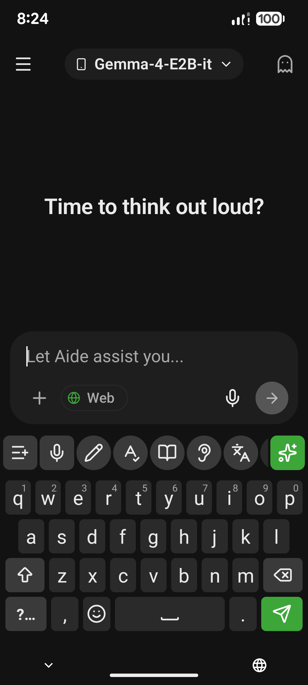

### Chat

Multi-chat workspace with markdown replies, image input that Gemma 4 reads as a multimodal turn, and a tappable thinking chip that opens the model's reasoning trace.

  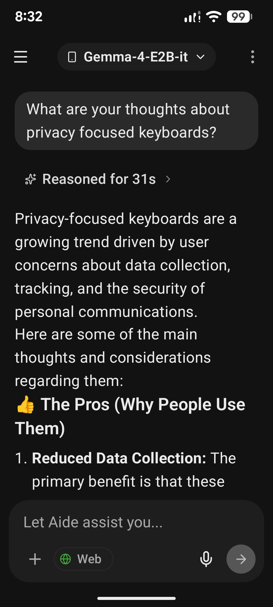
  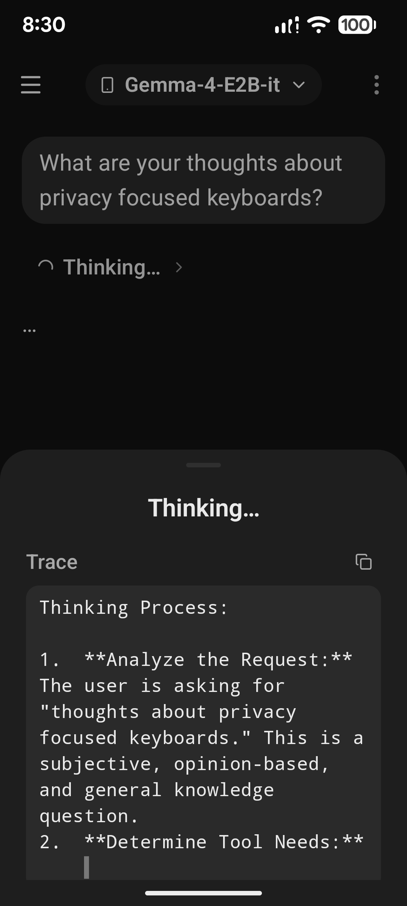
  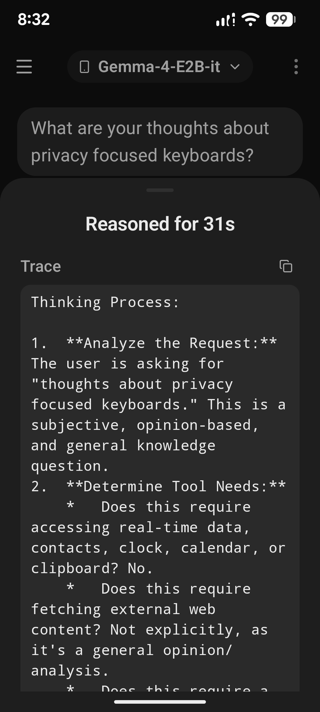

### Models

Pick a local Gemma 4 weight (E2B / E4B) or point at an Ollama endpoint for heavier weights. Selection is per-chat, swappable mid-session.

  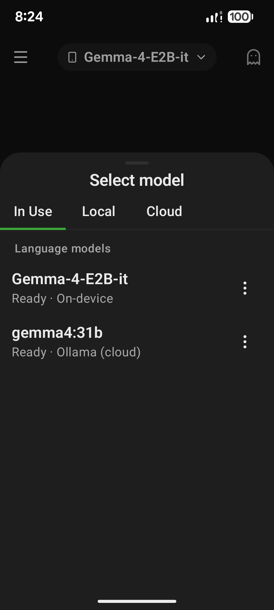
  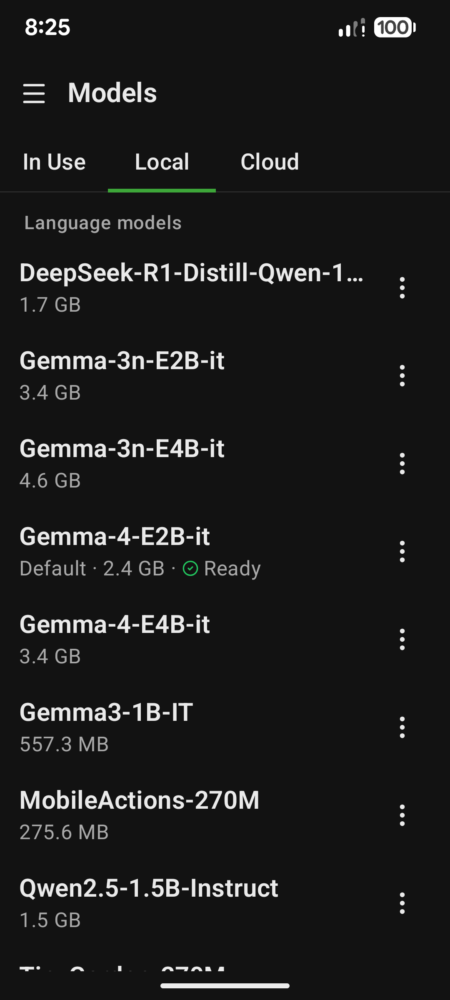
  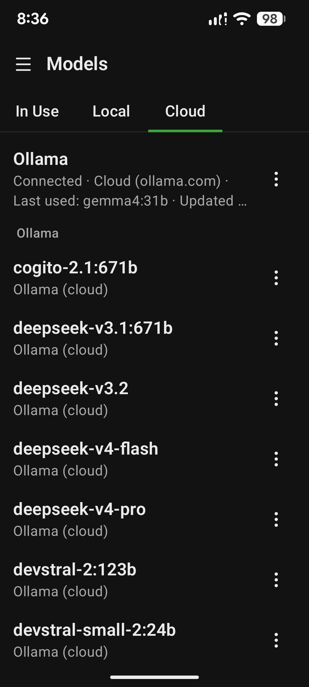

### Keyboard

A real Android `InputMethodService` with a transform bar above the keys (rephrase, simplify, fix grammar, summarize, tone shifts, key points, bullets, table view, three-reply suggestions) and a magic button for one-shot Custom Instructions. Every transform is a row in a local task table — edit the prompt, reorder, delete, or add your own with a `{{text}}` template.

  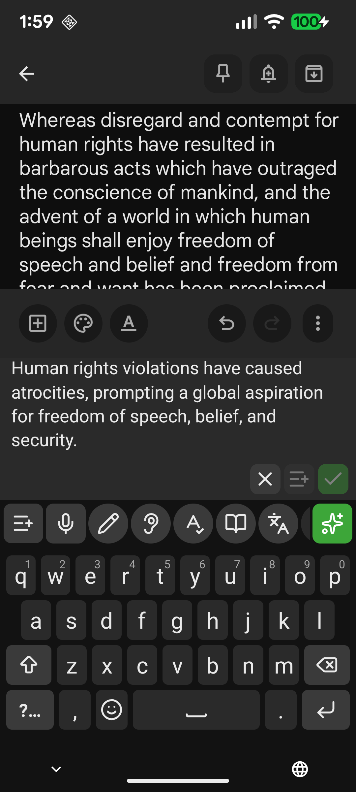
  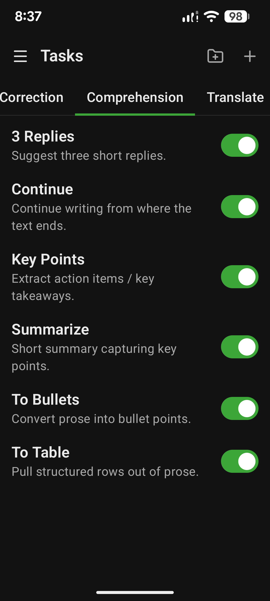
  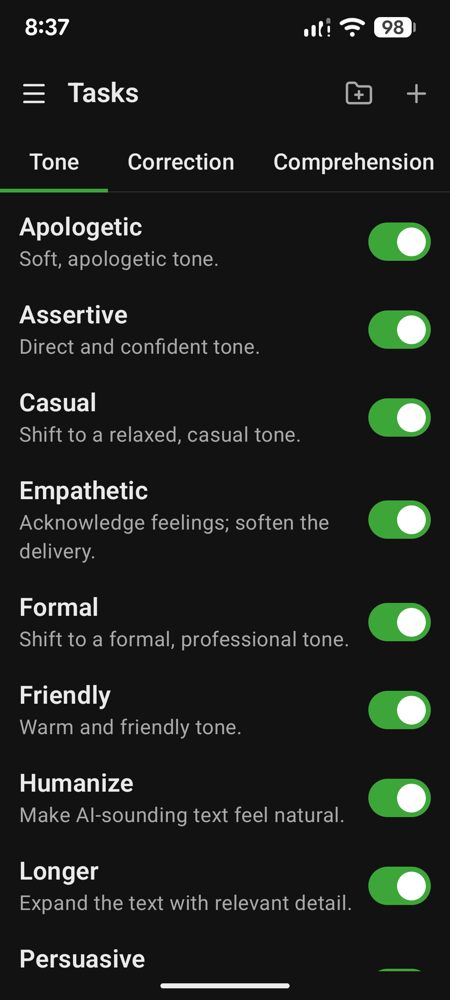
  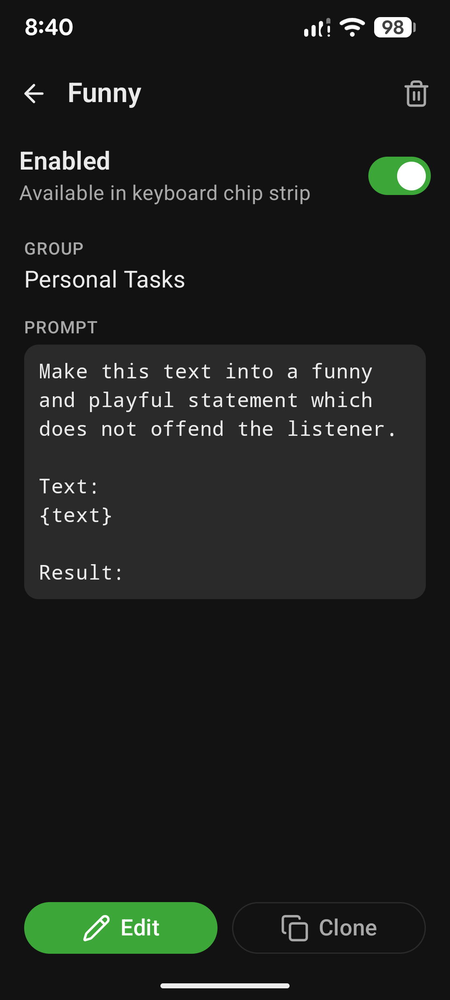
  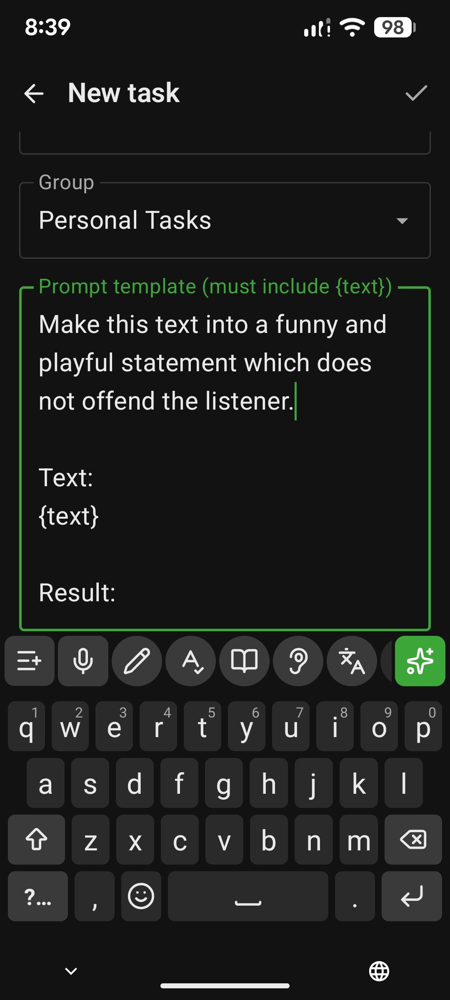

### Translation

37 languages on the transform bar, paired with 20+ on-device STT models. The keyboard can listen in one language and write back in another without phoning home.

  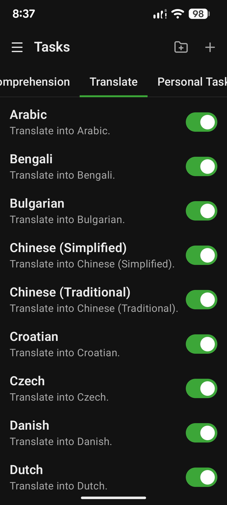

### Assistant

Long-press the assistant button for a turn-based voice loop: STT → Silero VAD → Gemma 4 → TTS, on-device by default.

  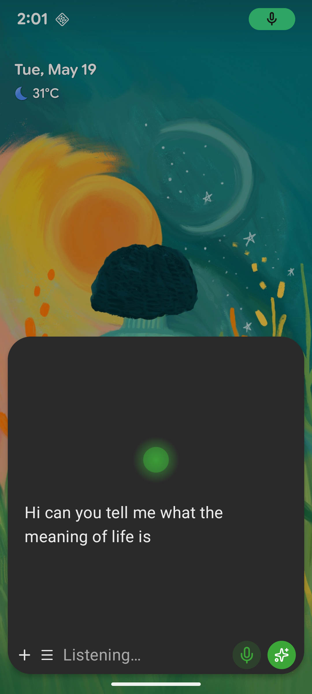
  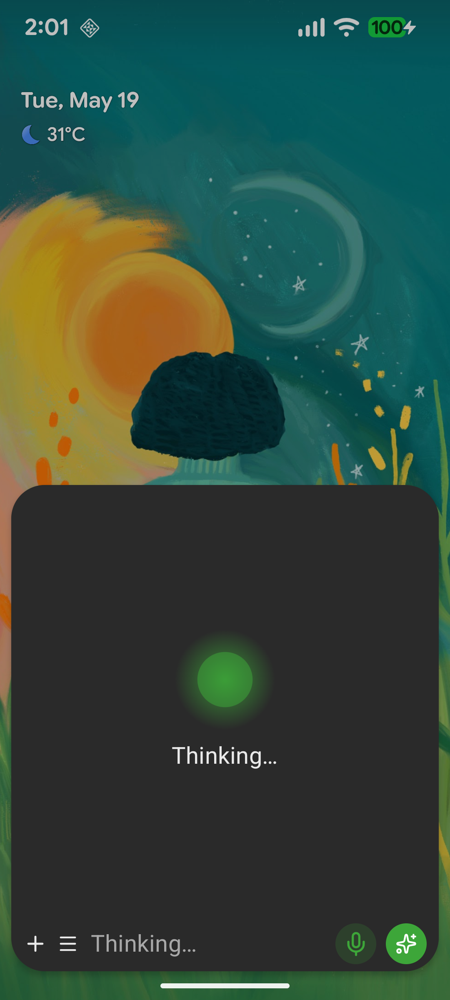
  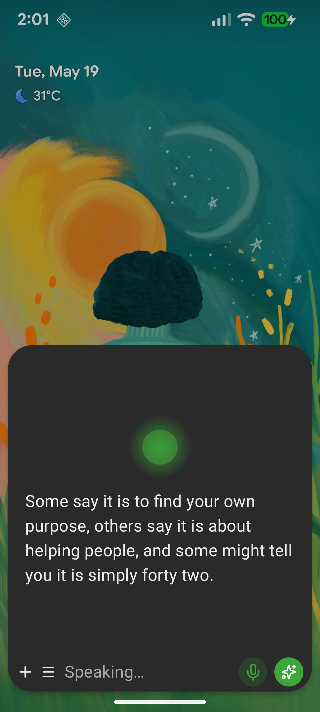

### Tool calling

Gemma 4's native function calling drives a single dispatcher for alarms, calendar, contacts, phone, clipboard, filesystem, web search (Tavily, Brave, DuckDuckGo, Ollama), calculator, and time. Per-category toggles in settings; destructive actions route through an INFO / WARN / DANGER confirmation gate.

  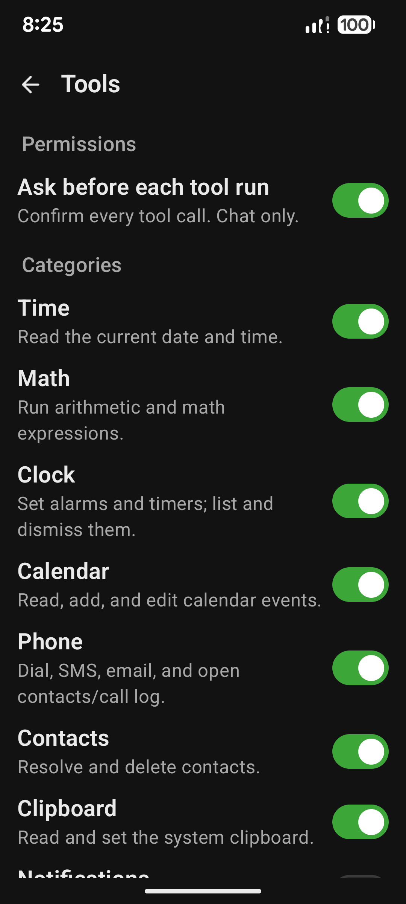
  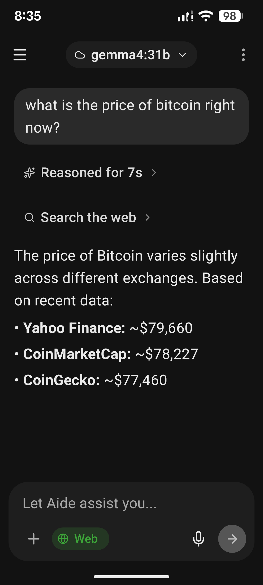

### Speech

Roughly 23 Piper, Kokoro, MeloTTS, and Matcha voices across 10+ languages for output; Zipformer, Whisper, Moonshine, Parakeet, SenseVoice, and GigaAM for input. Auto / Sherpa / System is a per-surface choice.

  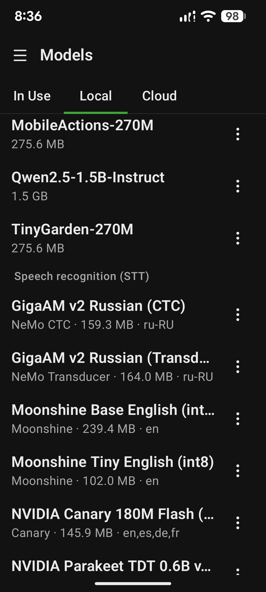
  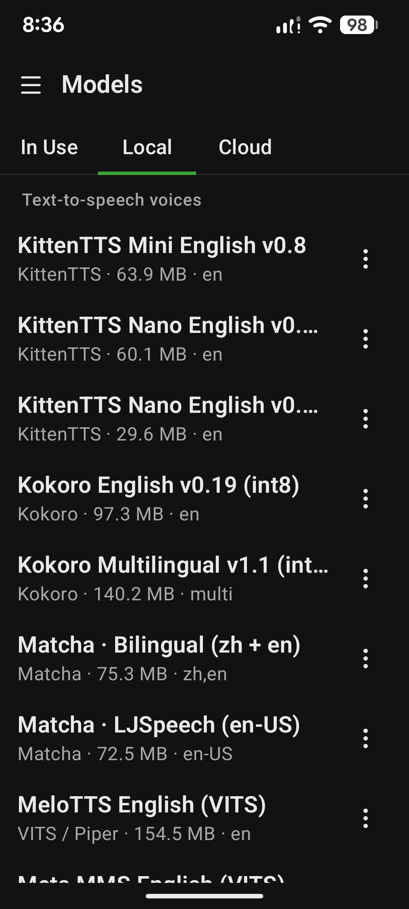

## Tech stack

- Kotlin, Jetpack Compose, Material 3
- Gemma 4 via LiteRT-LM (on-device); Ollama (optional cloud)
- Sherpa-ONNX for STT / TTS / VAD
- Room, Hilt, Coroutines
