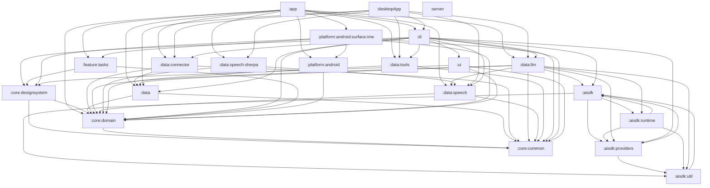

# Module graph

Generated by `./gradlew moduleGraph` — do not edit by hand. Every arrow points from a
module to something it depends on; see ARCHITECTURE.md §2 for what the direction means.

```mermaid
graph TD
  aisdk[":aisdk"] --> aisdk_providers[":aisdk:providers"]
  aisdk[":aisdk"] --> aisdk_runtime[":aisdk:runtime"]
  aisdk[":aisdk"] --> aisdk_util[":aisdk:util"]
  aisdk_providers[":aisdk:providers"] --> aisdk[":aisdk"]
  aisdk_providers[":aisdk:providers"] --> aisdk_util[":aisdk:util"]
  aisdk_runtime[":aisdk:runtime"] --> aisdk[":aisdk"]
  aisdk_runtime[":aisdk:runtime"] --> aisdk_providers[":aisdk:providers"]
  aisdk_runtime[":aisdk:runtime"] --> aisdk_util[":aisdk:util"]
  aisdk_util[":aisdk:util"] --> aisdk[":aisdk"]
  app[":app"] --> core_domain[":core:domain"]
  app[":app"] --> data[":data"]
  app[":app"] --> data_connector[":data:connector"]
  app[":app"] --> data_llm[":data:llm"]
  app[":app"] --> data_speech[":data:speech"]
  app[":app"] --> data_speech_sherpa[":data:speech:sherpa"]
  app[":app"] --> data_tools[":data:tools"]
  app[":app"] --> di[":di"]
  app[":app"] --> feature_tasks[":feature:tasks"]
  app[":app"] --> platform_android[":platform:android"]
  app[":app"] --> platform_android_surface_ime[":platform:android:surface:ime"]
  core_common[":core:common"]
  core_designsystem[":core:designsystem"] --> core_common[":core:common"]
  core_designsystem[":core:designsystem"] --> core_domain[":core:domain"]
  core_domain[":core:domain"] --> core_common[":core:common"]
  data[":data"] --> core_common[":core:common"]
  data[":data"] --> core_domain[":core:domain"]
  data_connector[":data:connector"] --> core_common[":core:common"]
  data_connector[":data:connector"] --> core_domain[":core:domain"]
  data_connector[":data:connector"] --> data[":data"]
  data_llm[":data:llm"] --> aisdk[":aisdk"]
  data_llm[":data:llm"] --> aisdk_providers[":aisdk:providers"]
  data_llm[":data:llm"] --> aisdk_runtime[":aisdk:runtime"]
  data_llm[":data:llm"] --> aisdk_util[":aisdk:util"]
  data_llm[":data:llm"] --> core_common[":core:common"]
  data_llm[":data:llm"] --> core_domain[":core:domain"]
  data_llm[":data:llm"] --> data[":data"]
  data_llm[":data:llm"] --> data_speech[":data:speech"]
  data_speech[":data:speech"] --> core_common[":core:common"]
  data_speech[":data:speech"] --> core_domain[":core:domain"]
  data_speech_sherpa[":data:speech:sherpa"] --> core_domain[":core:domain"]
  data_speech_sherpa[":data:speech:sherpa"] --> data_speech[":data:speech"]
  data_tools[":data:tools"] --> core_common[":core:common"]
  data_tools[":data:tools"] --> core_domain[":core:domain"]
  desktopApp[":desktopApp"] --> data[":data"]
  desktopApp[":desktopApp"] --> data_connector[":data:connector"]
  desktopApp[":desktopApp"] --> data_llm[":data:llm"]
  desktopApp[":desktopApp"] --> data_speech[":data:speech"]
  desktopApp[":desktopApp"] --> data_speech_sherpa[":data:speech:sherpa"]
  desktopApp[":desktopApp"] --> data_tools[":data:tools"]
  desktopApp[":desktopApp"] --> di[":di"]
  di[":di"] --> aisdk[":aisdk"]
  di[":di"] --> aisdk_providers[":aisdk:providers"]
  di[":di"] --> core_common[":core:common"]
  di[":di"] --> core_designsystem[":core:designsystem"]
  di[":di"] --> core_domain[":core:domain"]
  di[":di"] --> data[":data"]
  di[":di"] --> data_connector[":data:connector"]
  di[":di"] --> data_llm[":data:llm"]
  di[":di"] --> data_speech[":data:speech"]
  di[":di"] --> data_tools[":data:tools"]
  di[":di"] --> ui[":ui"]
  feature_tasks[":feature:tasks"] --> core_designsystem[":core:designsystem"]
  feature_tasks[":feature:tasks"] --> core_domain[":core:domain"]
  platform_android[":platform:android"] --> core_domain[":core:domain"]
  platform_android_surface_ime[":platform:android:surface:ime"] --> core_common[":core:common"]
  platform_android_surface_ime[":platform:android:surface:ime"] --> core_designsystem[":core:designsystem"]
  platform_android_surface_ime[":platform:android:surface:ime"] --> core_domain[":core:domain"]
  platform_android_surface_ime[":platform:android:surface:ime"] --> feature_tasks[":feature:tasks"]
  platform_android_surface_ime[":platform:android:surface:ime"] --> platform_android[":platform:android"]
  server[":server"]
  ui[":ui"] --> core_common[":core:common"]
  ui[":ui"] --> core_designsystem[":core:designsystem"]
  ui[":ui"] --> core_domain[":core:domain"]
```
